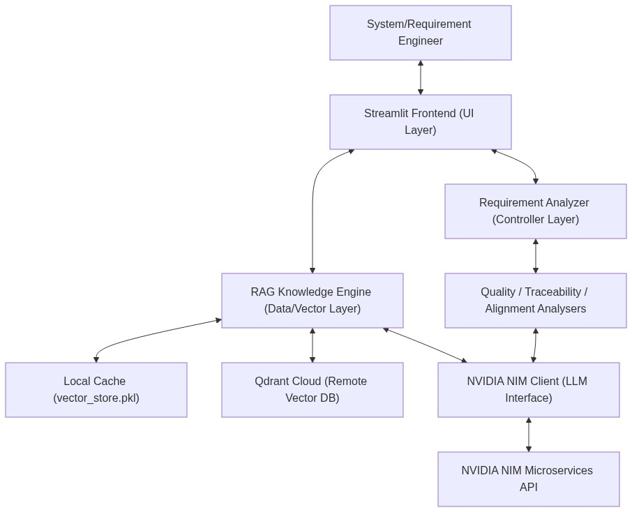
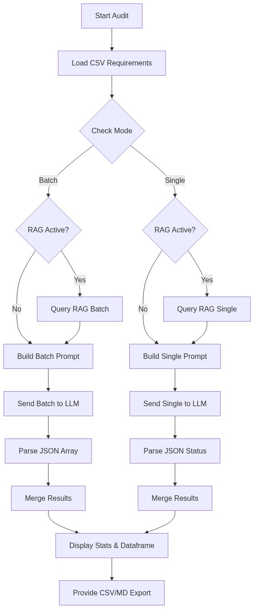
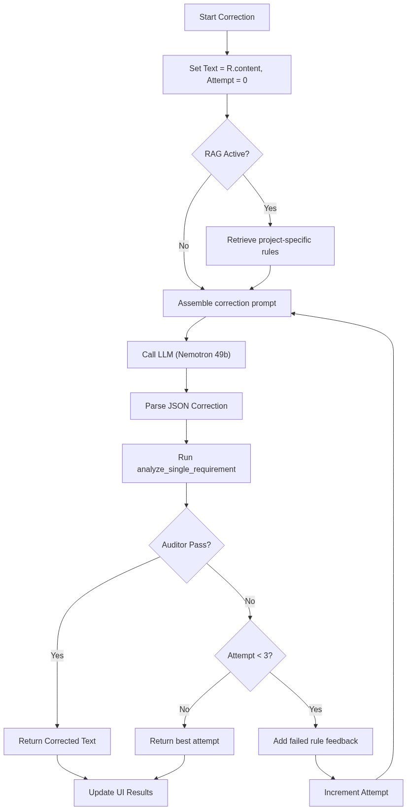
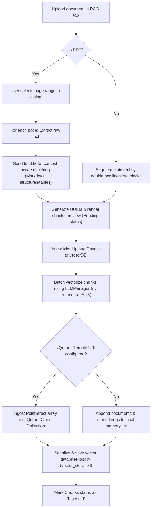

# RequirementValidator

### To install required libraries for the project
1. Open the terminal/commandprompt in the project folder
2. Enter the command, pip install -r requirements.txt

### To run the project
1. Open terminal/commandprompt in the project folder
2. Enter the command, streamlit run app.py
3. Open the browser and go to the URL http://localhost:8501/

### Project Tasks
- [ ] FrondEnd
    - [x] Implement a basic UI with 3 tabs, RAG engine, Requirement Analysis, Chatbot
    
- [ ] Requirement Analysis
    - [x] Create basic backend code to serve the frontend functionality.
    - [x] Fix the issue with message size that is being sent to the model, where model is unable to process due to the token length limit, Check if breaking the message into smaller arrays would help
    - [x] Add an option to process requirements input files in the form of .csv/.xlsx/.txt
    - [ ] The csv parsing shall pass the description of the requirement based on header dynamically since the requirement tools like doors, TRM can generate different header text, like ID, description etc.
    - [x] Provide options to upload different levels of requirements like automotive V cycle SWE.1, SWE.2 etc.
    - [ ] The tool shall process all the attached requirement files, if traceability is mentioned, check if the mentioned requirement is available in any other deck, if present check if the traceability is correct.
    - [ ] Generate the report on traceability quality, metrics.

- [ ] RAG Engine
    - [ ] Review the RAG engine code, train some documents and test the performance.
    - [ ] Generate the training metrics

- [ ] LLM Chatbot

---

# High-Level Design (HLD): Requirements Quality & Traceability Validator

This section provides the high-level software architecture, module design, and workflow flowcharts for the **INCOSE / ASPICE Automated Audit Tool** (also known as the *NVIDIA Mission Critical Assistant*).

## 1. System Overview

The RequirementValidator is an automated systems engineering assistant built on top of Streamlit and powered by NVIDIA NIM microservices. The tool helps engineering teams ensure that their requirements documents comply with industry standards (such as **INCOSE guidelines**, **EARS syntax**, **ASPICE V-cycle**, and **ISO 26262 safety standards**). It does so by performing quality checks, executing automated corrections, checking bidirectional traceability across levels of the V-cycle, and retrieving rules dynamically using a Retrieval-Augmented Generation (RAG) vector engine.

---

## 2. Architectural Layers

The codebase is structured into four primary layers, ensuring a separation of concerns and modularity.

### 2.1. Presentation / UI Layer (`UI/`)
Handles layout creation, file uploads, parameter configuration, status displays, and export actions.
*   **`app.py`**: The application entry point. Initializes session states (active LLM connection, RAG instance, requirements analyzer, and conversation histories), configures the side panel controls (retry parameters, active collections), and structures the layout tabs.
*   **[analysis_tab.py](file:///c:/BK/06_GenAI/RequirementValidator/UI/analysis_tab.py)**: Renders the central workspace dashboard for uploading CSV specifications, running quality assessments/corrections, and exporting findings as CSV/Markdown reports.
*   **[rag_tab.py](file:///c:/BK/06_GenAI/RequirementValidator/UI/rag_tab.py)**: Renders the interface for training the validator. Extracts texts from PDFs/documents, segments them via LLMs using self-correcting validation logic, and ingests them into vector stores.
*   **[chat_tab.py](file:///c:/BK/06_GenAI/RequirementValidator/UI/chat_tab.py)**: Implements an interactive terminal using standard Streamlit chat blocks to interface directly with the LLM.
*   **[search_tab.py](file:///c:/BK/06_GenAI/RequirementValidator/UI/search_tab.py)**: Allows engineers to input one-off requirements, run semantic search retrieves rules against standard guidelines, and get detailed compliance critiques.

### 2.2. Controller Layer (`Analysis/`)
Exposes unified interfaces for execution, acting as a dispatcher between frontend components and specific analysis logic.
*   **[analyzer.py](file:///c:/BK/06_GenAI/RequirementValidator/Analysis/analyzer.py)**: Implements the `RequirementAnalyzer` class. Delegates validation requests to lower-level domain executors:
    *   `analyze_requirements()` & `correct_requirements()` -> delegates to `quality_analyser`
    *   `compare_traceability()` -> delegates to `traceability_analyser`
*   **[loader.py](file:///c:/BK/06_GenAI/RequirementValidator/Analysis/loader.py)**: Safely ingests and streams files from Streamlit buffers into temporary CSV files for processing.

### 2.3. Analytics Domain Layer (`Analysis/`)
Executes technical checks, validations, and rewrites.
*   **[quality_analyser.py](file:///c:/BK/06_GenAI/RequirementValidator/Analysis/quality_analyser.py)**: Main engine for executing EARS/INCOSE evaluations. Implements single and batch API routines, multi-threaded worker pools, and an **iterative self-correction feedback loop** that re-evaluates LLM corrections against auditor rules to ensure high-fidelity outputs.
*   **[traceability_analyser.py](file:///c:/BK/06_GenAI/RequirementValidator/Analysis/traceability_analyser.py)**: Placeholder module for tracing connections between SWE.1 (HLD) and SWE.2 (LLD) specs.

### 2.4. Data & Core AI Layer
Defines entity models and provides foundational interfaces to the model serving APIs.
*   **[requirement.py](file:///c:/BK/06_GenAI/RequirementValidator/Model/requirement.py)**: Defines the standard `Requirement` model object. Employs dynamic CSV header detection (e.g. mapping "requirement", "description", or "text" to `content`) to ensure compatibility with standard industry engineering exports (e.g., IBM DOORS, PTC Windchill, Jama).
*   **[llm.py](file:///c:/BK/06_GenAI/RequirementValidator/Model/llm.py)**: Integrates with the OpenAI-compatible NVIDIA API. Standardizes model defaults (`nvidia/llama-3.3-nemotron-super-49b-v1.5` and `nvidia/nv-embedqa-e5-v5` embeddings). Incorporates API failure fault-tolerance via a thread-safe backoff retry mechanism.
*   **[rag_engine.py](file:///c:/BK/06_GenAI/RequirementValidator/RagEngine/rag_engine.py)**: Drives standard vector collection configuration, payload indexing, batch vectorization, and cosine similarity lookup. Automatically orchestrates a dual-backend system: using a remote **Qdrant DB instance** if env credentials exist, and falling back to a **local pickled NumPy database** (`vector_store.pkl`) otherwise.

---

## 3. Core Workflows and Flowcharts

This section details the primary runtime behaviors of the validator.

### 3.1. Requirements Quality Audit Workflow

This flowchart represents the audit workflow triggered when an engineer uploads a requirements specification CSV. It illustrates how the system switches between single-threaded RAG-assisted auditing and batch-processing, executing evaluations concurrently via worker threads.

---

### 3.2. Automated Requirement Correction & Self-Validation Loop

Correcting a requirement is not just a single-shot generation. The system employs an **iterative critique-and-validate** process (up to 3 attempts) where corrected text is fed back to the audit parser until the validator agrees the rewrite conforms to EARS syntax, modal restrictions, and singularity guidelines.

---

### 3.3. RAG Document Ingestion & Vector DB Architecture

This workflow defines the data path when a reference document (like an architecture manual or guideline PDF) is trained and ingested.

---

## 4. Design Patterns and Implementation Details

### 4.1. The Auditor Ruleset (INCOSE / EARS)
The system prompts enforce strict constraints inside [quality_analyser.py](file:///c:/BK/06_GenAI/RequirementValidator/Analysis/quality_analyser.py):
1.  **EARS Syntax**: Enforces standard keywords (`WHEN`, `WHILE`, `IF...THEN`, `WHERE`). Violation of preconditions defaults to warnings or "Review" statuses.
2.  **Modal Verbs**: Limits binding criteria strictly to the modal verb `SHALL`. Vetoes words like *should*, *will*, *must*, *can*, or *behaves*.
3.  **Atomicity (Singularity)**: Standard requirements must represent exactly one action. If multiple actions are conjoined (via commas, lists, or connectors like *and/or*), the correction engine is instructed to split the requirement into separate lines while duplicating the preconditions.
4.  **Ambiguity Removal**: Replaces subjective descriptions (*quickly*, *appropriate*, *normal*, *optimized*, *safe*) with structured placeholder metrics.

### 4.2. Dual Vector DB Mechanism
Inside [rag_engine.py](file:///c:/BK/06_GenAI/RequirementValidator/RagEngine/rag_engine.py), the RAG component operates on a graceful degradation model.
*   **Pickle Store**: Uses `pickle` to serialize document structures and NumPy matrices to save locally. Searches are calculated using vectorized dot products normalized by matrix norms:
    $$\text{Similarity} = \frac{\mathbf{A} \cdot \mathbf{B}}{\|\mathbf{A}\| \|\mathbf{B}\|}$$
*   **Qdrant Client**: Integrates standard database features (indexing payloads on fields like `item_type`, `item_id`, `page` and setting up Tokenizer word indexes) when `QDRANT_URL` and `QDRANT_API_KEY` are provided.

---

## 5. Technology Stack Summary

| Technology Component | Specific Integration / Version | Purpose |
| :--- | :--- | :--- |
| **Frontend Framework** | Streamlit | Rapid interactive web dashboard |
| **LLM Provider** | NVIDIA NIM API (OpenAI SDK Wrapper) | Core AI reasoning, chunk extraction, and rewriting |
| **Text Generator Model** | `nvidia/llama-3.3-nemotron-super-49b-v1.5` | Requirements auditing and correction reviews |
| **Embedding Model** | `nvidia/nv-embedqa-e5-v5` (1024-dim) | Semantic retrieval vector builder |
| **Vector Index Server** | Qdrant Client / Local Pickle NumPy fallback | Vector storage, keyword indexing, and cosine search |
| **Document Parser** | PyMuPDF (`fitz`) | High-speed PDF text parsing |
| **Concurrency Pool** | Python `ThreadPoolExecutor` | Parallel network calls (speeding up evaluations) |